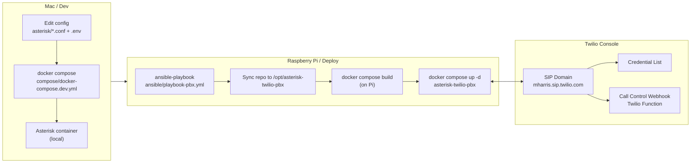
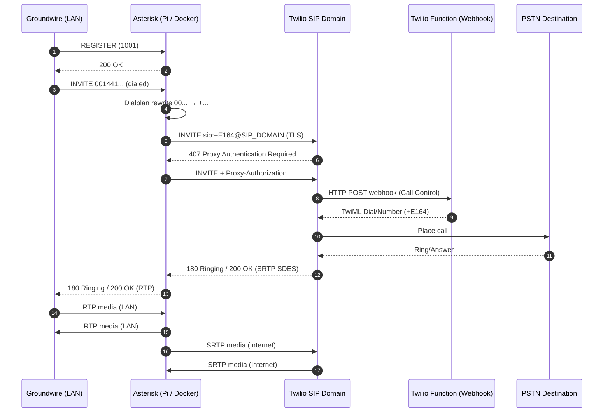

# Asterisk ↔ Twilio PBX (Docker + Raspberry Pi + Ansible)

This repo is a **containerised Asterisk PBX** that:

- Lets **LAN softphones (e.g. Groundwire)** register to Asterisk.
- Connects Asterisk to **Twilio Programmable Voice via a Twilio SIP Domain**.
- Places outbound calls via Twilio using **TLS signalling + SRTP media (SDES)**.
- Deploys to a Raspberry Pi with **one Ansible playbook** that:
  - syncs the repo to the Pi
  - builds the image locally
  - starts the stack with Docker Compose

If you’re building a “real PBX” at home/in a lab, this setup is cool because it’s:

- **Reproducible**: infra + config lives in git, secrets live in `.env`.
- **Portable**: same container can run on a Mac (dev) or a Pi (prod-ish).
- **Debuggable**: everything is plain files + Asterisk CLI commands.
- **Secure by default** (for this class of project): TLS + SRTP, no unauthenticated endpoints.

> For operational details and verification commands see **[RUNBOOK.md](./RUNBOOK.md)**.

This repo also includes the ODIN/RIZZY voice-agent flow (Asterisk → Twilio `<Connect><Stream>` → `odin-realtime-bridge` → OpenAI Realtime).
See **Voice agents (ODIN + RIZZY)** in **[RUNBOOK.md](./RUNBOOK.md)**.

### odin-realtime-bridge (the cool bit)

The WebSocket bridge that makes the voice agents work lives in [realtime-bridge/README.md](realtime-bridge/README.md).

Why it’s neat:

- Bridges Twilio Media Streams to OpenAI Realtime with end-to-end G.711 μ-law (`g711_ulaw`).
- Handles streamed tool-call arguments safely (executes on `response.function_call_arguments.done`).
- Implements paced outbound audio + backpressure trimming to keep barge-in usable.
- Includes detailed Mermaid diagrams of the architecture and call flow.

---

## Repository lifecycle (why this is neat)

### 1) Dev → Deploy → Runtime



### 2) Call flow (what happens when you dial)



---

## Key concepts (current repo reality)

### Twilio “SIP Domain” (not Elastic SIP Trunking)

This repo is wired to **Twilio Voice → SIP Domains**.

That means:

- Twilio challenges outbound INVITEs with **407 Proxy Authentication**.
- After auth succeeds, Twilio needs **Call Control Configuration** (Webhook/TwiML) to decide what to do.
- Without call control, you’ll see **404 Not Found** after a successful 407.

### TLS + SRTP are required

Twilio required:

- Secure SIP transport (**TLS**) → Asterisk uses `twilio-transport-tls`.
- Secure media (**SRTP**) → Asterisk uses `media_encryption=sdes`.

### NAT/audio correctness (why EXTERNAL_IP + LAN_IP exist)

Asterisk runs inside Docker, so it *can* advertise Docker bridge IPs in SDP (e.g. `172.19.0.2`), which breaks audio.

To keep audio working:

- For the **Twilio leg**, Asterisk must advertise a routable **public** IP → `EXTERNAL_IP`.
- For the **LAN phone leg**, Asterisk must advertise the Pi’s **LAN** IP → `LAN_IP`.

---

## Repository layout

```text
asterisk-twilio-pbx/
  asterisk/
    pjsip.conf.template     # PJSIP transports/endpoints/registration (rendered via envsubst)
    extensions.conf         # Dialplan (00... -> +..., caller ID policy)
    rtp.conf                # RTP range (10000-10100)
    modules.conf            # Module config
  docker/
    Dockerfile              # Debian bullseye + asterisk + openssl/ca-certificates
    entrypoint.sh           # env validation + cert generation + envsubst
  compose/
    docker-compose.dev.yml  # dev compose (ports published, bind-mounted configs)
    docker-compose.pi.yml   # reference compose (not used by Ansible path)
  ansible/
    inventory.ini
    playbook-pbx.yml
    roles/pbx_pi/
      tasks/main.yml        # sync repo to Pi, copy .env, build + up
      templates/docker-compose.pi.yml.j2
  .env.example
  RUNBOOK.md
  README.md
```

---

## Quick Start (Raspberry Pi)

### 1) Prereqs

- Raspberry Pi reachable via SSH
- Docker installed (playbook handles this)
- macOS machine running Ansible

### 2) Configure inventory

Edit `ansible/inventory.ini`:

```ini
[pbx_pi]
pbxpi ansible_host=<pi-hostname-or-ip>

[pbx_pi:vars]
ansible_user=<ssh-user>
ansible_ssh_private_key_file=~/.ssh/id_rsa
```

### 3) Configure `.env`

```bash
cp .env.example .env
$EDITOR .env
```

Required variables (see `.env.example` for full list):

- `TWILIO_USERNAME`
- `TWILIO_PASSWORD`
- `TWILIO_DOMAIN` (your SIP Domain)
- `TWILIO_PSTN_DOMAIN` (for SIP Domains, this can be the same as `TWILIO_DOMAIN`)
- `TWILIO_CALLERID` (Twilio-accepted caller ID)
- `EXTERNAL_IP` (public IP as seen by Twilio)
- `LAN_IP` (Pi’s LAN IP)
- `GW_1001_PASSWORD`

### 4) Deploy

```bash
ansible-playbook -i ansible/inventory.ini ansible/playbook-pbx.yml -K
```

What it does:

- syncs this repo to `/opt/asterisk-twilio-pbx`
- copies your local `.env` to the Pi
- builds the Docker image on the Pi
- runs the container and publishes SIP/RTP ports

---

## Twilio setup (SIP Domain + Function webhook)

### 1) SIP Domain authentication

In **Voice → Manage → SIP domains → <your-domain>**:

- attach a **Credential List** containing your username/password
- (optional) attach an **IP ACL** if you want to lock down which public IPs can originate calls

### 2) Call Control Configuration (this is what makes calls work)

Still on the SIP Domain page, under **Call Control Configuration**:

- Set **A CALL COMES IN** to **Webhook**
- Paste your Function URL (example):
  `https://sip-dial-5846.twil.io/dial`
- Save

### 3) Twilio Function (example)

Create a Twilio Function at `/dial`:

```js
exports.handler = function(context, event, callback) {
  // event.To is often: "sip:+14155550100@yourdomain.sip.twilio.com"
  const rawTo = (event.To || '').toString();
  const match = rawTo.match(/\+\d+/);
  const toNumber = match ? match[0] : null;

  const twiml = new Twilio.twiml.VoiceResponse();
  if (!toNumber) {
    twiml.say('No destination number found');
    return callback(null, twiml);
  }

  // Set this to your verified/twilio-owned caller ID
  const dial = twiml.dial({ callerId: '+15550199999' });
  dial.number(toNumber);

  return callback(null, twiml);
};
```

---

## Groundwire settings (extension 1001)

- **Server/Domain**: `<Pi LAN IP>` (example `192.168.1.188`)
- **Port**: `5060`
- **Transport**: UDP
- **Username/Auth user**: `1001`
- **Password**: value of `GW_1001_PASSWORD`

---

## Dialing

The dialplan rewrites:

- `00...` → `+...` (E.164)

Example:

- Dial Bermuda number `0014415994174` (Groundwire)

---

## Verification

On the Pi:

```bash
# Twilio registration
sudo docker exec asterisk-twilio-pbx asterisk -rx 'pjsip show registrations'

# Groundwire registration
sudo docker exec asterisk-twilio-pbx asterisk -rx 'pjsip show aor 1001'

# Useful live debugging
sudo docker exec asterisk-twilio-pbx asterisk -rx 'pjsip set logger on'
```

---

## Voice agents (ODIN + RIZZY)

This repo includes optional voice agents:

- **ODIN** (SOC master): dial **6346**
- **RIZZY ODIN** (dry-humour threat-intel analyst, nephew-friendly): dial **7499**

Asterisk routes the call to Twilio, which then opens a Twilio **Media Stream** to a public WebSocket endpoint.

Recommended deployment:
- Deploy the bridge service at `realtime-bridge/` to Fly.io as `odin-realtime-bridge`.
- Update your Twilio Function `/dial` to route `sip:6346@...` (ODIN) **and** `sip:7499@...` (RIZZY) to `<Connect><Stream>`.

Quick links:
- Bridge code: [`realtime-bridge/`](./realtime-bridge/)
- Twilio Function template: [`realtime-bridge/twilio-function-odin-dial.js`](./realtime-bridge/twilio-function-odin-dial.js)

High-level flow:

```text
Groundwire -> Asterisk (ext 6346 or 7499) -> Twilio SIP Domain -> Twilio Function (/dial)
-> <Connect><Stream> -> wss://odin-realtime-bridge.fly.dev/twilio/stream
-> odin-realtime-bridge selects persona (ODIN vs RIZZY) from signed token
-> OpenAI Realtime
```

See RUNBOOK for step-by-step deployment and debugging.

For tool-calling guardrails and bridge tool debug logging (`TOOL_CALL_LIMIT`, `TOOL_LOG_LEVEL`, `TOOL_EVENT_LOG_LEVEL`), see **[RUNBOOK.md](./RUNBOOK.md)**.

## Troubleshooting (fast)

| Symptom | Likely Cause | Fix |
|--------|--------------|-----|
| `488 Secure SIP transport required` | Twilio requires TLS | Ensure Twilio endpoint uses TLS transport + port 5061 |
| `488 Secure media required` | Twilio requires SRTP | Set `media_encryption=sdes` |
| `403 Forbidden` immediately (no 407) | Twilio policy/IP ACL | Fix SIP Domain auth (ACL/credentials) |
| `404 Not found` after a successful 407 | SIP Domain has no call-control | Set Call Control Configuration webhook/TwiML |
| Call connects but **no audio** | Bad SDP address (Docker IP leaked) | Set `EXTERNAL_IP` + `LAN_IP` and PJSIP `external_*_address` |

For a deeper runbook, see **[RUNBOOK.md](./RUNBOOK.md)**.

---

## GitHub Actions / CI/CD (optional)

This repo includes GitHub Actions workflows for building and deploying images.

However, the current Ansible role deploy path builds locally on the Pi from the synced repo. If you want a “pull from GHCR” model instead, you can adapt the role/template back to using a published image.
