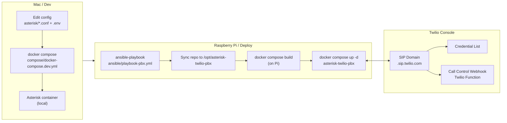

## How to read this repo (recommended)

This repository is documented at multiple levels because it touches
real-time voice, SIP, and production constraints.

If you’re short on time:

- **Live ODIN call behaviour (annotated)**  
  → `docs/realtime-flow.md`

- **PBX + Twilio operational details**  
  → `RUNBOOK.md`

- **Realtime bridge internals (state machine, buffering, barge-in, tools)**  
  → `realtime-bridge/README.md`

The remainder of this README provides a guided architectural overview
and reference.


# Asterisk ↔ Twilio PBX (SIP) → Realtime Voice Agents (Twilio Media Streams → OpenAI Realtime)

This repo is a **portfolio-grade “old-school SIP” bridge** that combines:

- **Asterisk (PJSIP) PBX** in Docker
- **Twilio SIP Domains** (TLS signalling + SRTP media)
- **Twilio Call Control (Functions/TwiML)**
- A real-time, agentic voice layer: **Twilio Media Streams → `odin-realtime-bridge` (Fly.io) → OpenAI Realtime**

It’s designed to show how a classic PBX can become a **natural language interface** to a modern “sensor fusion” threat-intel stack.


> Editable source: `docs/diagrams/odin-realtime-architecture.drawio`

## Why this project exists (portfolio narrative)

Most “AI demos” never touch real networks, real protocols, or real operational constraints.

This project is intentionally the opposite: it’s a **network services** build that starts with a real PBX and ends with a real-time, tool-using voice agent.

The goal is to demonstrate:

- **People**: a human can ask natural questions over a phone call.
- **Process**: a repeatable daily/rolling threat-intel workflow (SITREP + drill-down).
- **Technology**: SIP/TLS/SRTP + Twilio Call Control + Media Streams + OpenAI Realtime + tool-backed data.

In other words: “old-school SIP” as a stable edge interface → “agentic” analysis and action on the back end.

> For operational details, troubleshooting, and verification commands see **[RUNBOOK.md](./RUNBOOK.md)**.

---

## What you can do with it (3 call modes)

### 1) LAN phone → PSTN (via Twilio)
Dial from a local SIP phone (Yealink, Groundwire, etc.):

- Dial `00...` and Asterisk rewrites to `+...` (E.164)
- Asterisk sends SIP over **TLS** to Twilio
- Twilio uses your **Call Control webhook** to decide what to do
- Twilio places the PSTN call

### 2) Dial **6346** → ODIN (SOC master voice agent)
Call flow:

`SIP phone → Asterisk → Twilio SIP Domain → Twilio Function (/dial) → <Connect><Stream> → odin-realtime-bridge → OpenAI Realtime`

ODIN opens with a short cyber SITREP (default past 24h) then lets you drill into:
- “Headlines”
- Vendor/campaign search
- CVE/KEV lookups

### 3) Dial **7499** → RIZZY ODIN (nephew-friendly analyst persona)
Same flow as ODIN, with a different prompt/persona selected by a signed token.

---

## Repository lifecycle: Dev → Deploy → Runtime

### 1) Dev → Deploy → Runtime



---

## Architecture overview (two planes)

### A) Voice/SIP plane (real-time)
- LAN handset registers to Asterisk (PJSIP) (e.g. extension 1001)
- Asterisk places outbound calls to Twilio SIP Domain (TLS + SRTP SDES)
- Twilio Call Control (Function) decides:
  - PSTN `<Dial><Number>` **or**
  - Agent `<Connect><Stream>` (Twilio Media Streams)

### B) Threat-intel data plane (near-real-time)
The voice agent’s “brain” is intentionally wired to a simple API surface:

- **OSINT ingestion** (RSS/Atom “bulk watching”)
- **Enrichment**: NVD / CISA KEV / EPSS + light analysis
- **Clustering** into “what matters” + short summaries
- A periodic **SITREP** (e.g. “past 24h” and a daily 07:15 run)
- Exposed via **PostgREST** so the bridge can fetch context quickly
- Optional semantic drill-down via **Cyberscape Nexus** (semantic search service)

This separation keeps the call path fast: the bridge **serves cached SITREP context** during calls and refreshes in the background.

---

## MVP data model (what’s in scope)

The MVP focuses on OSINT + L1 cyber analysis as a data product.

Inputs:
- RSS/Atom sources (bulk ingestion)
- NVD (CVE), CISA KEV, EPSS (enrichment)

Processing:
- Normalize + enrich items (severity, confidence, CVE linkage)
- Cluster “related” items into themes
- Produce rollups:
  - a rolling **past-24h SITREP** (default call window)
  - a daily scheduled report (e.g. **07:15**) for “what changed since yesterday”

Serving:
- PostgREST exposes a minimal read API for:
  - latest SITREP text
  - recent entries
  - CVE/KEV/EPSS lookups
- The voice agent uses this cached context at call start, then uses tools for drill-down.

---

## How the SIP → Twilio → Agent handoff works

### Outbound call signalling (Twilio SIP Domain)
- Asterisk registers to Twilio (PJSIP `registration`)
- Outbound INVITE to Twilio is challenged with **407**
- Asterisk resends with digest auth (`twilio-auth`)
- Twilio then invokes the **Call Control webhook** for routing

### Agent routing (TwiML)
When you dial `6346` or `7499`:
- Your Twilio Function returns TwiML `<Connect><Stream>` to the Fly.io bridge.
- The Function creates a short-lived **HMAC-signed token** and passes it:
  - in the Stream URL query string **and**
  - redundantly in `start.customParameters` via `<Stream><Parameter>`.

This redundancy is deliberate: Twilio has been observed to occasionally strip/mangle querystrings during the WebSocket upgrade.

### Realtime audio and tool calls (bridge)
The bridge (`realtime-bridge/src/server.js`) is built for “voice UX” realities:

- End-to-end audio is **G.711 μ-law** (`g711_ulaw`) for simplicity and interoperability.
- Assistant audio is **paced** (20ms frames) to preserve barge-in.
- Backpressure is handled by trimming oldest queued audio (bounded latency).
- Tool calls execute only after `response.function_call_arguments.done` to avoid empty/partial argument execution.

See: **[`realtime-bridge/README.md`](./realtime-bridge/README.md)** for diagrams and env vars.

---

## Inbound PSTN calls (Twilio Number → allowlist → agent / voicemail)

In addition to SIP Domain call-control, you can route **inbound calls to your Twilio phone number** using ANI allowlists:

- known callers → greeting → ODIN/RIZZY
- unknown callers → Twilio voicemail recording + email link

Docs: **[`docs/inbound-number.md`](./docs/inbound-number.md)**


---

### 2) Call flow (what happens when you dial)


---

## Key concepts (current repo reality)

### Twilio “SIP Domain” (not Elastic SIP Trunking)

This repo is wired to **Twilio Voice → SIP Domains**.

That means:

- Twilio challenges outbound INVITEs with **407 Proxy Authentication**.
- After auth succeeds, Twilio needs **Call Control Configuration** (Webhook/TwiML) to decide what to do.
- Without call control, you’ll see **404 Not Found** after a successful 407.

### TLS + SRTP are required

Twilio required:

- Secure SIP transport (**TLS**) → Asterisk uses `twilio-transport-tls`.
- Secure media (**SRTP**) → Asterisk uses `media_encryption=sdes`.

### NAT/audio correctness (why EXTERNAL_IP + LAN_IP exist)

Asterisk runs inside Docker, so it *can* advertise Docker bridge IPs in SDP (e.g. `172.19.0.2`), which breaks audio.

To keep audio working:

- For the **Twilio leg**, Asterisk must advertise a routable **public** IP → `EXTERNAL_IP`.
- For the **LAN phone leg**, Asterisk must advertise the Pi’s **LAN** IP → `LAN_IP`.

---

## Repository layout

```text
asterisk-twilio-pbx/
  asterisk/
    pjsip.conf.template     # PJSIP transports/endpoints/registration (rendered via envsubst)
    extensions.conf         # Dialplan (00... -> +..., caller ID policy)
    rtp.conf                # RTP range (10000-10100)
    modules.conf            # Module config
  docker/
    Dockerfile              # Debian bullseye + asterisk + openssl/ca-certificates
    entrypoint.sh           # env validation + cert generation + envsubst
  compose/
    docker-compose.dev.yml  # dev compose (ports published, bind-mounted configs)
    docker-compose.pi.yml   # reference compose (not used by Ansible path)
  ansible/
    inventory.ini
    playbook-pbx.yml
    roles/pbx_pi/
      tasks/main.yml        # sync repo to Pi, copy .env, build + up
      templates/docker-compose.pi.yml.j2
  .env.example
  RUNBOOK.md
  README.md

```

---

## Security & ops notes (read this before exposing anything to the Internet)

This is a lab/portfolio PBX. Treat it like a production SIP service anyway.

### Ports
- **5060/udp**: LAN SIP registrations (keep LAN-only; do not expose publicly)
- **5061/tcp**: SIP TLS to Twilio (restrict inbound; only Twilio IP ranges if you enable inbound calling)
- **10000–10100/udp**: RTP/SRTP media (same story: restrict as much as possible)

### Secrets
- PBX secrets live in **`.env`** (never commit)
- Twilio Function has its own secrets:
  - `ODIN_HMAC_SECRET` must match Fly secret `TWILIO_STREAM_HMAC_SECRET`

### Asterisk hardening
- `modules.conf` currently uses `autoload=yes` for simplicity. For a hardened install, reintroduce a minimal `noload = ...` list once stable.
- The Twilio endpoint currently lands in `context=outbound`. For inbound Twilio calls, create a dedicated `from-twilio` context.

---


## Quick Start (Raspberry Pi)

### 1) Prereqs

- Raspberry Pi reachable via SSH
- Docker installed (playbook handles this)
- macOS machine running Ansible

### 2) Configure inventory

Edit `ansible/inventory.ini`:

```ini
[pbx_pi]
pbxpi ansible_host=<pi-hostname-or-ip>

[pbx_pi:vars]
ansible_user=<ssh-user>
ansible_ssh_private_key_file=~/.ssh/id_rsa
```

### 3) Configure `.env`

```bash
cp .env.example .env
$EDITOR .env
```

Required variables (see `.env.example` for full list):

- `TWILIO_USERNAME`
- `TWILIO_PASSWORD`
- `TWILIO_DOMAIN` (your SIP Domain)
- `TWILIO_PSTN_DOMAIN` (for SIP Domains, this can be the same as `TWILIO_DOMAIN`)
- `TWILIO_CALLERID` (Twilio-accepted caller ID)
- `EXTERNAL_IP` (public IP as seen by Twilio)
- `LAN_IP` (Pi’s LAN IP)
- `GW_1001_PASSWORD`

### 4) Deploy

```bash
ansible-playbook -i ansible/inventory.ini ansible/playbook-pbx.yml -K
```

What it does:

- syncs this repo to `/opt/asterisk-twilio-pbx`
- copies your local `.env` to the Pi
- builds the Docker image on the Pi
- runs the container and publishes SIP/RTP ports

---

## Twilio setup (SIP Domain + Function webhook)

### 1) SIP Domain authentication

In **Voice → Manage → SIP domains → <your-domain>**:

- attach a **Credential List** containing your username/password
- (optional) attach an **IP ACL** if you want to lock down which public IPs can originate calls

### 2) Call Control Configuration (this is what makes calls work)

Still on the SIP Domain page, under **Call Control Configuration**:

- Set **A CALL COMES IN** to **Webhook**
- Paste your Function URL (example):
  `https://sip-dial-5846.twil.io/dial`
- Save

### 3) Twilio Function (example)

Create a Twilio Function at `/dial`:

```js
exports.handler = function(context, event, callback) {
  // event.To is often: "sip:+14155550100@yourdomain.sip.twilio.com"
  const rawTo = (event.To || '').toString();
  const match = rawTo.match(/\+\d+/);
  const toNumber = match ? match[0] : null;

  const twiml = new Twilio.twiml.VoiceResponse();
  if (!toNumber) {
    twiml.say('No destination number found');
    return callback(null, twiml);
  }

  // Set this to your verified/twilio-owned caller ID
  const dial = twiml.dial({ callerId: '+15550199999' });
  dial.number(toNumber);

  return callback(null, twiml);
};
```

---

## LAN phone settings (extension 1001)

For a SIP handset/base on your LAN (e.g. **Yealink W73P/W70B**):

- **Server/Registrar**: `<Pi LAN IP>`
- **Port**: `5060`
- **Transport**: UDP
- **User / Auth ID**: `1001`
- **Password**: value of `GW_1001_PASSWORD`
- **Codecs**: allow **PCMA/PCMU** (G.711 A-law / μ-law)

---

## Dialing

The dialplan rewrites:

- `00...` → `+...` (E.164)


---

## Verification

On the Pi:

```bash
# Twilio registration
sudo docker exec asterisk-twilio-pbx asterisk -rx 'pjsip show registrations'

# Extension registration (1001)
sudo docker exec asterisk-twilio-pbx asterisk -rx 'pjsip show aor 1001'

# Useful live debugging
sudo docker exec asterisk-twilio-pbx asterisk -rx 'pjsip set logger on'
```

---

## Voice agents (ODIN + RIZZY)

This repo includes optional voice agents:

- **ODIN** (SOC master): dial **6346**
- **RIZZY ODIN** (dry-humour threat-intel analyst): dial **7499**

Asterisk routes the call to Twilio, which then opens a Twilio **Media Stream** to a public WebSocket endpoint.

Recommended deployment:
- Deploy the bridge service at `realtime-bridge/` to Fly.io as `odin-realtime-bridge`.
- Update your Twilio Function `/dial` to route `sip:6346@...` (ODIN) **and** `sip:7499@...` (RIZZY) to `<Connect><Stream>`.

Quick links:
- Bridge code: [`realtime-bridge/`](./realtime-bridge/)
- Twilio Function template: [`realtime-bridge/twilio-function-odin-dial.js`](./realtime-bridge/twilio-function-odin-dial.js)

High-level flow:

```text
LAN phone -> Asterisk (ext 6346 or 7499) -> Twilio SIP Domain -> Twilio Function (/dial)
-> <Connect><Stream> -> wss://odin-realtime-bridge.fly.dev/twilio/stream
-> odin-realtime-bridge selects persona (ODIN vs RIZZY) from signed token
-> OpenAI Realtime
```

See RUNBOOK for step-by-step deployment and debugging.

For tool-calling guardrails and bridge tool debug logging (`TOOL_CALL_LIMIT`, `TOOL_LOG_LEVEL`, `TOOL_EVENT_LOG_LEVEL`), see **[RUNBOOK.md](./RUNBOOK.md)**.

## Troubleshooting (fast)

| Symptom | Likely Cause | Fix |
|--------|--------------|-----|
| `488 Secure SIP transport required` | Twilio requires TLS | Ensure Twilio endpoint uses TLS transport + port 5061 |
| `488 Secure media required` | Twilio requires SRTP | Set `media_encryption=sdes` |
| `403 Forbidden` immediately (no 407) | Twilio policy/IP ACL | Fix SIP Domain auth (ACL/credentials) |
| `404 Not found` after a successful 407 | SIP Domain has no call-control | Set Call Control Configuration webhook/TwiML |
| Call connects but **no audio** | Bad SDP address (Docker IP leaked) | Set `EXTERNAL_IP` + `LAN_IP` and PJSIP `external_*_address` |

For a deeper runbook, see **[RUNBOOK.md](./RUNBOOK.md)**.

---

## GitHub Actions / CI/CD (optional)

This repo includes GitHub Actions workflows for building and deploying images.

However, the current Ansible role deploy path builds locally on the Pi from the synced repo. If you want a “pull from GHCR” model instead, you can adapt the role/template back to using a published image.
