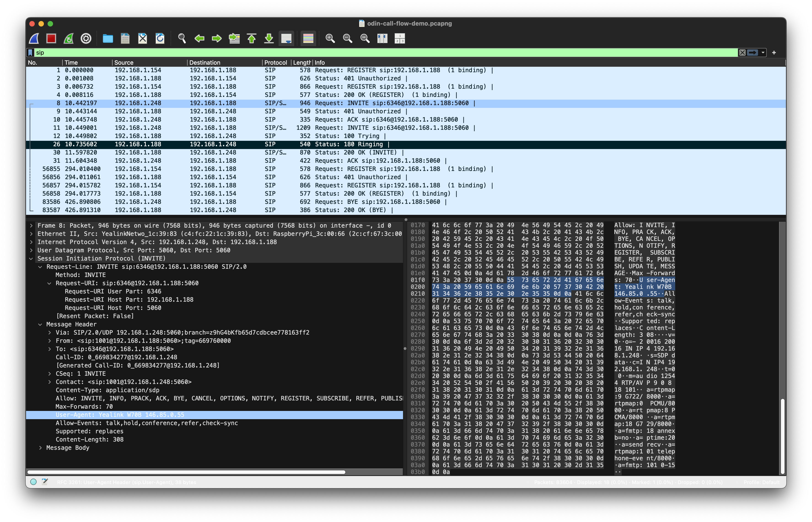
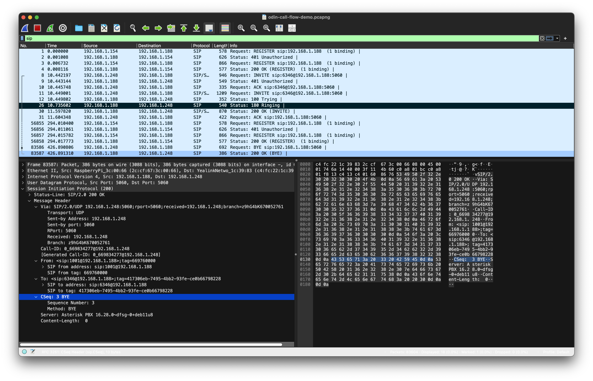
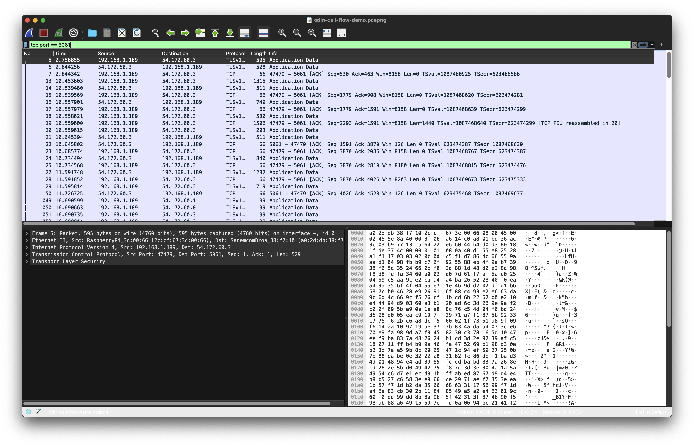

# Appendix: SIP teardown verification (Wireshark)

This appendix contains **supporting screenshots** from a Wireshark capture
taken during the ODIN call described in `docs/realtime-flow.md`.

The purpose is to demonstrate **observability and correctness** of SIP
dialog teardown on the LAN (cleartext) leg. These artefacts are not required
to understand the system, but are included for completeness.

---

## A) LAN-side SIP call setup (INVITE / 200 OK)

**Notes**
- Yealink handset initiates `INVITE sip:6346@192.168.1.188:5060`
- PBX responds with `100 Trying`, `180 Ringing`, `200 OK`
- SDP negotiation visible and correct

---

## B) Clean SIP teardown (BYE → 200 OK)

**Notes**
- BYE observed on the LAN leg
- PBX responds with `200 OK`
- No retransmits or error conditions
- Indicates orderly dialog termination

---

## C) TLS-protected SIP leg (Twilio side)

**Notes**
- SIP over TLS on TCP/5061 is intentionally opaque
- Analysis relies on timing and teardown direction, not payload inspection
- This is expected and desirable behaviour
