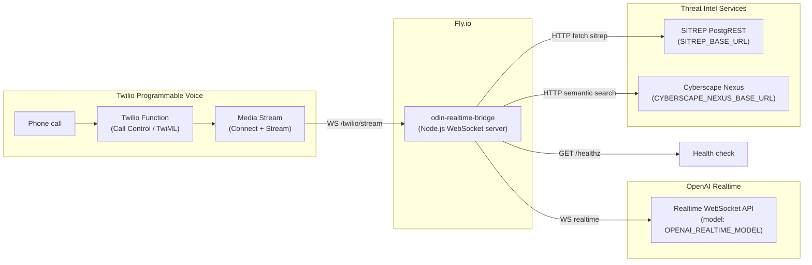
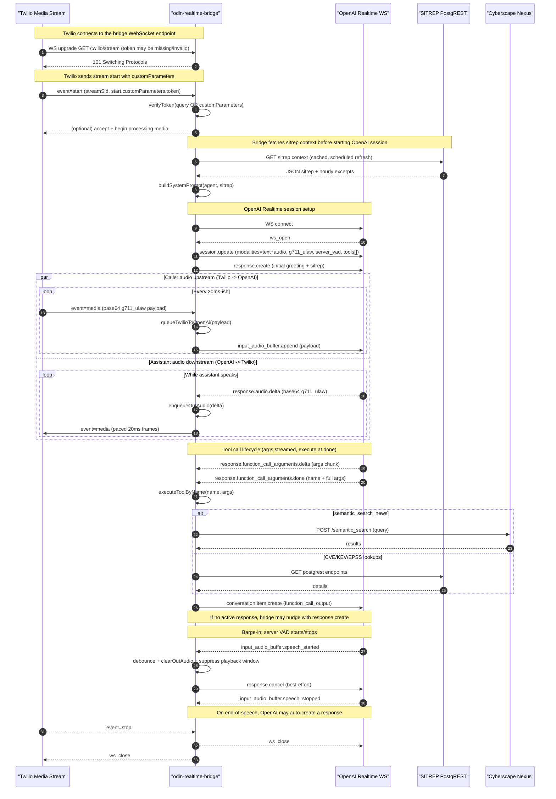
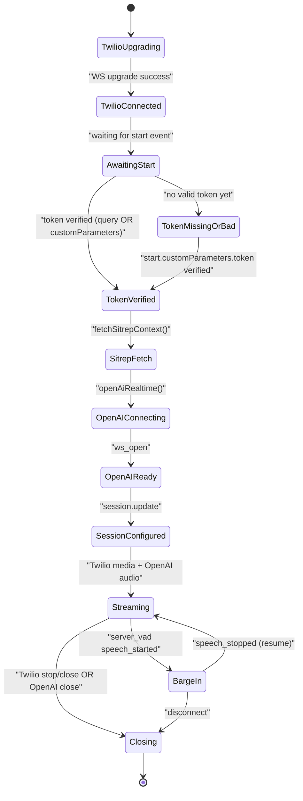
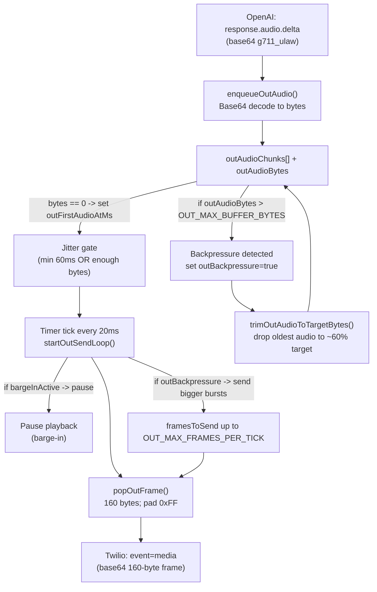

# odin-realtime-bridge

WebSocket bridge used by Twilio `<Connect><Stream>` to talk to OpenAI Realtime.

## Diagrams (Mermaid)

These diagrams reflect the current implementation in `src/server.js`:

- Twilio connects to `GET /twilio/stream?token=...` (token may be missing/invalid in query).
- If query token is missing/invalid, the bridge accepts the WebSocket upgrade and later expects a valid token via Twilio Media Stream `start.customParameters`.
- Audio is **G.711 μ-law** end-to-end (`g711_ulaw`) and is paced to Twilio in ~20ms frames.
- Tool calls execute only after `response.function_call_arguments.done`.

### 1) High-level architecture



### 2) Call + stream sequence (most common path)



### 3) Per-call connection state (bridge-side)



### 4) Audio buffering + pacing + backpressure (OpenAI -> Twilio)



## Environment variables

- `OPENAI_API_KEY` (required)
- `OPENAI_REALTIME_MODEL` (optional) e.g. `gpt-realtime-2025-08-28`
- `OPENAI_VOICE` (optional) default `alloy` (voice name for realtime TTS)
- `TWILIO_STREAM_HMAC_SECRET` (required) – used to validate Twilio Stream URL tokens (must match Twilio Function `ODIN_HMAC_SECRET`)
- `SITREP_BASE_URL` (optional) defaults to `https://your-postgrest-instance.example.com`
- `CYBERSCAPE_NEXUS_BASE_URL` (optional) default `https://your-nexus-instance.example.com` (semantic news search service)
- `SITREP_WINDOW_HOURS` (optional) default `24` (agent’s default “SITREP window”)
- `SITREP_REFRESH_SECONDS` (optional) default `1800` (30 min) (scheduled refresh interval)
- `SITREP_HOURLY_HISTORY_HOURS` (optional) default `168` (cache last 7 days of hourly sitreps)
- `OUT_MAX_BUFFER_MS` (optional) default `20000` (max assistant audio buffered locally; higher reduces drops, lower improves barge-in responsiveness)
- `OUT_MAX_FRAMES_PER_TICK` (optional) default `10` (when backpressure is detected, allow larger send bursts to drain backlog and avoid trimming)
- `VAD_BARGE_IN_DEBOUNCE_MS` (optional) default `450` (debounce chatty server VAD so noisy lines don’t repeatedly clear/suppress audio)
- `TOOL_CALL_LIMIT` (optional) default `6` (max _counted_ tool calls per phone call; argument errors do not count)
- `TOOL_CALL_HARD_LIMIT` (optional) default `30` (hard cap including invalid-arg tool calls; prevents infinite loops)
- `TOOL_ARG_ERROR_LIMIT` (optional) default `3` (max argument errors per tool before we force the model to ask the caller)
- `TOOL_LOG_LEVEL` (optional) default `errors` (`none` | `errors` | `all`) — controls how much tool execution info is logged
- `TOOL_EVENT_LOG_LEVEL` (optional) default `none` (`none` | `ids` | `verbose`) — logs tool-event ID fields / argument streaming shapes from OpenAI Realtime (useful when tool calls have empty args)

## Behavior notes (important for ops)

### Tool calling reliability

OpenAI Realtime streams tool arguments in pieces. The bridge **waits for**:

- `response.function_call_arguments.done`

…before executing tools, to avoid empty/partial argument execution.

### Audio backpressure (no “cancel loop”)

If OpenAI generates audio faster-than-realtime, the bridge’s outbound queue can grow.

- When the queue exceeds `OUT_MAX_BUFFER_MS`, the bridge **trims oldest queued audio** to keep latency bounded.
- It does **not** rely on repeatedly cancelling responses (which previously could lead to “silence”).

If you see frequent `buffer_high_trim_audio` in logs, increase `OUT_MAX_BUFFER_MS` and/or `OUT_MAX_FRAMES_PER_TICK`.

## Fly deploy (manual)

From this directory:

```bash
fly launch --name odin-realtime-bridge --region lhr --no-deploy
fly secrets set OPENAI_API_KEY=... TWILIO_STREAM_HMAC_SECRET=...
fly deploy
```

### Debug logging (Fly)

Temporarily enable tool debug logging:

- `fly secrets set -a odin-realtime-bridge TOOL_LOG_LEVEL=all TOOL_EVENT_LOG_LEVEL=ids`

Revert to normal logging:

- `fly secrets set -a odin-realtime-bridge TOOL_LOG_LEVEL=errors TOOL_EVENT_LOG_LEVEL=none`

## Local run

```bash
npm install
OPENAI_API_KEY=... TWILIO_STREAM_HMAC_SECRET=... npm run dev
```

---

## Twilio call-control Functions

This repo includes example Twilio Functions for the SIP Domain “Call comes in” webhook.

### `/dial` (SIP Domain inbound)

File: `twilio-function-odin-dial.js`

- **ODIN / RIZZY**: for `sip:6346@...` and `sip:7499@...` it returns TwiML:
  - `<Connect><Stream>` to `ODIN_STREAM_URL` (with HMAC token)
- **PSTN**: for `sip:+E164@...` it returns TwiML:
  - `<Dial action="/dial-result" method="POST"><Number>+E164</Number></Dial>`

### `/dial-result` (PSTN outcome handling)

File: `twilio-function-dial-result.js`

This is the `<Dial action>` handler. It branches on `DialCallStatus` and returns per-status TwiML.

Possible `DialCallStatus` values:

- `completed`
- `busy`
- `no-answer`
- `failed`
- `canceled`

If you want different behavior (e.g. retries, voicemail, or forwarding), change the TwiML in `/dial-result`.
